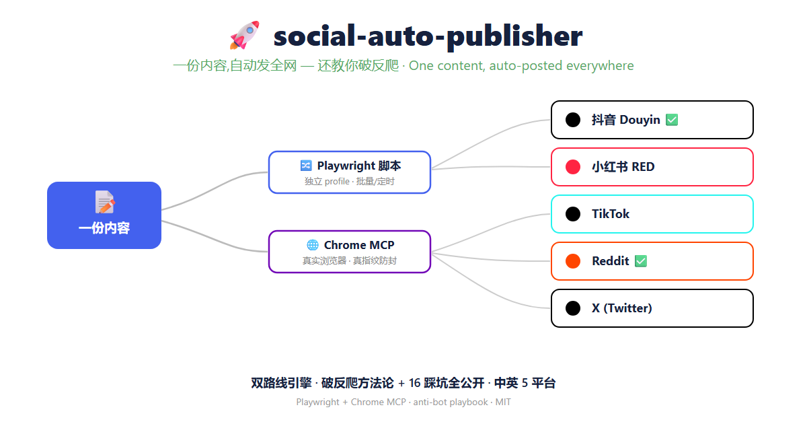

# social-auto-publisher

Multi-platform social posting via **Playwright scripts** + **Chrome MCP** (real browser).
Douyin · Xiaohongshu · TikTok · Reddit · X.

多平台社媒自动发布:Playwright 脚本 + Chrome MCP 真实浏览器,**双路线**。中英 5 平台。



## Why this exists

Most auto-poster repos just hand you Selenium/Playwright code. The code was never the hard part — **getting past each platform's anti-bot walls is**. This repo documents the techniques that actually work, with **16 real pitfalls** written up in the SOPs.

别的仓库只丢代码。难点从来不是代码,是**怎么真的绕过平台反爬**。这里把实战管用的技术连同 16 个踩坑全写进 SOP。

## Two routes

| Route | Engine | Platforms | When to use |
|---|---|---|---|
| **Scripted** | Playwright (`channel:chrome`, persistent profile) | Douyin · TikTok · Reddit · X | batch / scheduled |
| **Real browser** | Chrome MCP | Xiaohongshu | real fingerprint, toughest anti-bot |

## What actually works (the hard-won bits)

- **Douyin image upload** — the browser-extension `file_upload` API is sandboxed (only session-attached files), and the native OS file dialog is unreachable from DOM automation. Fix: Playwright `setInputFiles` → CDP `DOM.setFileInputFiles`, which bypasses both.
- **Reddit anti-bot** — a fresh blank profile hitting `old.reddit/submit` gets a `network policy` block (`whoa there, pardner!`). What gets through: **one continuous session** (homepage → log in → submit, never split into separate runs) + real login cookies + `www.reddit.com`. You model a real user, not a stealthier bot.
- **new reddit shadow DOM** — title/body are web components; `getByPlaceholder` / `[contenteditable]` resolve as "not visible". Coordinate clicks + keyboard input get in.
- **Anti-detection** — `navigator.webdriver` stripped; `--disable-blink-features=AutomationControlled`; persistent profile so cookies/history look human.

## Platforms

| Platform | Route | Status |
|---|---|---|
| Douyin 抖音 | Playwright | ✅ verified — posted successfully |
| Reddit | Playwright | ✅ verified — full flow to submit |
| TikTok | Playwright + proxy | 🟡 ready, not e2e-tested |
| X (Twitter) | Playwright adapter | ⚪ works, not tested in this repo |
| Xiaohongshu 小红书 | Chrome MCP | ⚪ route proven, not scripted here |

## Quick start

```bash
npm install                       # playwright-core only — reuses system Chrome, no 150MB download
node douyin-test.mjs login        # scan QR once; the profile persists for reuse
node douyin-test.mjs send img.png # fill content → human-confirm gate → publish
```

Each script exposes `login` / `publish` / `send` / `check` style modes — see the SOPs.

## Architecture

- `playwright-core` + `channel:chrome` — reuse the system Chrome, skip the browser download
- `launchPersistentContext` with an isolated `userData` dir — log in once per platform, reuse forever
- **human-confirmation gate** — scripts fill everything, screenshot, then wait for a go-signal before clicking publish (publishing is irreversible)

## Deep dives

- [**Douyin SOP**](SOP-douyin-playwright-publish.md) — why extensions fail, sandbox bypass, content-review flags
- [**Reddit SOP**](SOP-reddit-publish.md) — beating `network policy`, shadow-DOM coordinate input, private-subreddit detection

## Caveats

- Coordinate clicks assume a **1366×900 viewport** — adjust if yours differs.
- TikTok needs an **overseas proxy** (a mainland-CN IP is an instant block).
- Use it on **your own accounts**, respect each platform's ToS and rate limits. Fresh accounts spamming links get banned — warm them up first.

## License

[MIT](LICENSE)
